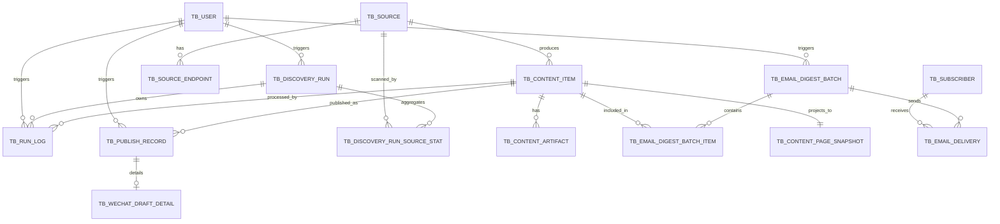

# TechBrief 数据库设计文档

更新时间：2026-06-04

## 1. 文档目标

本文档基于以下输入统一设计 TechBrief 的业务数据库模型：

- [TechBrief-PRD.md](file:///home/shixuan/code/TechBrief/TechBrief-PRD.md)
- [Technical-Solution-Report.md](file:///home/shixuan/code/TechBrief/docs/delivery/Technical-Solution-Report.md)
- 原型目录 `stitch_ai_insight_bridge` 中的全部 HTML 与截图

目标是给出一套**可直接落地到 PostgreSQL 的业务数据库设计**，覆盖项目全部业务功能，并与对象存储、Wagtail 页面投影、Celery 工作流、邮件订阅、微信草稿、GA4 分析需求保持一致。

## 2. 设计范围与原则

### 2.1 设计范围

本设计覆盖以下模块：

- 用户与管理员认证
- 来源配置与发现入口
- 内容主数据、对象存储引用、处理阶段运行日志
- 公开站点发布投影
- 邮件订阅、每日汇总批次与投递记录
- 微信公众号草稿发布记录
- 后台仪表盘、内容管理、工作流监控、手动发布所需数据

### 2.2 设计原则

- **PostgreSQL 作为 source of truth**：只存业务核心数据、结构化内容和索引引用。
- **腾讯云 COS 存大对象**：`raw_html`、字幕、音频、图片和调试导出不直接落主业务表。
- **单库单实例优先**：当前项目为单人维护，MVP 不做分库分表。
- **显式状态流转**：所有关键阶段必须有状态字段或运行日志可追踪。
- **统一 UUID 主键**：为后续跨环境迁移、对象存储前缀定位和潜在分片保留空间。
- **避免过度拆表**：结构化正文、译文、研究报告优先存 `JSONB/TEXT`，不做块级关系表。

### 2.3 命名约定

- 业务表前缀统一为 `tb_`
- 主键统一为 `id UUID`
- 审计字段统一为：`created_at`、`updated_at`
- 时间字段统一使用 `TIMESTAMPTZ`
- 枚举优先使用 `VARCHAR + CHECK`，避免 PostgreSQL ENUM 迁移成本过高

## 3. 总体实体关系



## 4. 表清单

| 表名                             | 作用                            |
| ------------------------------ | ----------------------------- |
| `tb_user`                      | 平台管理员账号表                      |
| `tb_source`                    | 内容来源主表                        |
| `tb_source_endpoint`           | 来源发现入口配置表                     |
| `tb_discovery_run`             | 巡检任务主表                        |
| `tb_discovery_run_source_stat` | 巡检任务按来源统计表                    |
| `tb_content_item`              | 内容主表                          |
| `tb_content_artifact`          | 对象存储文件引用表                     |
| `tb_run_log`                   | 内容处理阶段运行日志表                   |
| `tb_subscriber`                | 邮件订阅者表                        |
| `tb_email_digest_batch`        | 每日汇总邮件批次表                     |
| `tb_email_digest_batch_item`   | 每日汇总与内容关联表                    |
| `tb_email_delivery`            | 每个订阅者的邮件投递记录表                 |
| `tb_publish_record`            | 渠道发布主记录表                      |
| `tb_wechat_draft_detail`       | 微信草稿发布详情表                     |
| `tb_content_page_snapshot`     | 公开站点内容页投影表                    |
| `tb_home_page`                 | 首页配置表                         |
| `tb_listing_page`              | 列表 / Archive 页面配置表            |
| `tb_static_page`               | About / Privacy / Terms 等静态页表 |

## 5. 详细表结构

### 5.1 `tb_user`

**业务作用**：平台管理员账号。MVP 仅支持单管理员或少量管理员，不引入复杂 RBAC。

| 字段名                 | 数据类型        | 长度/约束 | 非空 | 键  | 默认值                 | 业务释义              |
| ------------------- | ----------- | ----- | -- | -- | ------------------- | ----------------- |
| `id`                | UUID        | PK    | Y  | PK | `gen_random_uuid()` | 管理员主键             |
| `username`          | VARCHAR     | 64    | Y  | UK | -                   | 登录用户名，全局唯一        |
| `password_hash`     | VARCHAR     | 128   | Y  | -  | -                   | Django 密码哈希值，不存明文 |
| `email`             | VARCHAR     | 255   | N  | UK | `NULL`              | 管理员邮箱，可为空         |
| `display_name`      | VARCHAR     | 128   | Y  | -  | `'Admin'`           | 后台显示名称            |
| `is_active`         | BOOLEAN     | -     | Y  | -  | `TRUE`              | 是否可登录             |
| `is_platform_admin` | BOOLEAN     | -     | Y  | -  | `TRUE`              | 是否平台管理员，MVP 恒为真   |
| `last_login_at`     | TIMESTAMPTZ | -     | N  | -  | `NULL`              | 最近一次登录时间          |
| `created_at`        | TIMESTAMPTZ | -     | Y  | -  | `now()`             | 创建时间              |
| `updated_at`        | TIMESTAMPTZ | -     | Y  | -  | `now()`             | 更新时间              |

**索引设计**

- 唯一索引：`uk_tb_user_username`
- 唯一索引：`uk_tb_user_email`（允许空值）

**关联关系**

- 一对多：`tb_user -> tb_discovery_run`
- 一对多：`tb_user -> tb_publish_record`
- 一对多：`tb_user -> tb_email_digest_batch`

***

### 5.2 `tb_source`

**业务作用**：管理内容来源主体，如 OpenAI、Anthropic、指定视频频道。

| 字段名                  | 数据类型        | 长度/约束     | 非空 | 键  | 默认值                 | 业务释义                                                   |
| -------------------- | ----------- | --------- | -- | -- | ------------------- | ------------------------------------------------------ |
| `id`                 | UUID        | PK        | Y  | PK | `gen_random_uuid()` | 来源主键                                                   |
| `source_code`        | VARCHAR     | 32        | Y  | UK | -                   | 来源编码，如 `openai`、`anthropic`                            |
| `source_name`        | VARCHAR     | 128       | Y  | -  | -                   | 来源展示名称                                                 |
| `source_type`        | VARCHAR     | 32, CHECK | Y  | -  | `'official_site'`   | 来源类型：`official_site`、`video_channel`、`manual_external` |
| `base_url`           | VARCHAR     | 512       | N  | -  | `NULL`              | 来源主站 URL                                               |
| `default_language`   | VARCHAR     | 16        | Y  | -  | `'en'`              | 来源默认语言                                                 |
| `is_enabled`         | BOOLEAN     | -         | Y  | -  | `TRUE`              | 是否启用                                                   |
| `schedule_cron_expr` | VARCHAR     | 64        | Y  | -  | `'0 2 * * *'`       | 调度表达式；MVP 默认每日 1 次，后续可按来源单独调整                          |
| `notes`              | TEXT        | -         | N  | -  | `NULL`              | 备注说明                                                   |
| `created_at`         | TIMESTAMPTZ | -         | Y  | -  | `now()`             | 创建时间                                                   |
| `updated_at`         | TIMESTAMPTZ | -         | Y  | -  | `now()`             | 更新时间                                                   |

**索引设计**

- 唯一索引：`uk_tb_source_source_code`
- 普通索引：`idx_tb_source_is_enabled`
- 组合索引：`idx_tb_source_enabled_schedule`（`is_enabled + schedule_cron_expr`）

**关联关系**

- 一对多：`tb_source -> tb_source_endpoint`
- 一对多：`tb_source -> tb_content_item`

***

### 5.3 `tb_source_endpoint`

**业务作用**：定义每个来源的发现入口，如 RSS、HTML 列表页、Sitemap、视频频道。

| 字段名                    | 数据类型        | 长度/约束     | 非空 | 键  | 默认值                 | 业务释义                                             |
| ---------------------- | ----------- | --------- | -- | -- | ------------------- | ------------------------------------------------ |
| `id`                   | UUID        | PK        | Y  | PK | `gen_random_uuid()` | 入口主键                                             |
| `source_id`            | UUID        | FK        | Y  | FK | -                   | 关联来源                                             |
| `endpoint_type`        | VARCHAR     | 32, CHECK | Y  | -  | -                   | 入口类型：`rss`、`html_list`、`sitemap`、`video_channel` |
| `endpoint_role`        | VARCHAR     | 32, CHECK | Y  | -  | `'primary'`         | 入口角色：`primary`、`fallback`、`supplemental`         |
| `endpoint_url`         | VARCHAR     | 1024      | Y  | -  | -                   | 入口 URL                                           |
| `content_type_scope`   | VARCHAR     | 32, CHECK | Y  | -  | `'mixed'`           | 覆盖内容类型：`article`、`video`、`mixed`                 |
| `priority`             | SMALLINT    | -         | Y  | -  | `100`               | 执行优先级，数值越小优先级越高                                  |
| `parser_config`        | JSONB       | -         | N  | -  | `NULL`              | 抓取/解析配置，如 CSS selector、频道白名单                     |
| `last_etag`            | VARCHAR     | 255       | N  | -  | `NULL`              | 最近一次 ETag                                        |
| `last_modified_header` | VARCHAR     | 255       | N  | -  | `NULL`              | 最近一次 Last-Modified 头                             |
| `last_success_at`      | TIMESTAMPTZ | -         | N  | -  | `NULL`              | 最近成功巡检时间                                         |
| `is_enabled`           | BOOLEAN     | -         | Y  | -  | `TRUE`              | 是否启用                                             |
| `created_at`           | TIMESTAMPTZ | -         | Y  | -  | `now()`             | 创建时间                                             |
| `updated_at`           | TIMESTAMPTZ | -         | Y  | -  | `now()`             | 更新时间                                             |

**索引设计**

- 普通索引：`idx_tb_source_endpoint_source_id`
- 普通索引：`idx_tb_source_endpoint_enabled_priority`
- 唯一索引：`uk_tb_source_endpoint_source_url`（`source_id + endpoint_url`）

**关联关系**

- 多对一：`tb_source_endpoint -> tb_source`
- 一对多：`tb_source_endpoint -> tb_discovery_run_source_stat`

***

### 5.4 `tb_discovery_run`

**业务作用**：记录一次巡检任务的执行实例，支持定时巡检、人工触发、回放重跑。

| 字段名                    | 数据类型        | 长度/约束     | 非空 | 键  | 默认值                 | 业务释义                                                        |
| ---------------------- | ----------- | --------- | -- | -- | ------------------- | ----------------------------------------------------------- |
| `id`                   | UUID        | PK        | Y  | PK | `gen_random_uuid()` | 巡检任务主键                                                      |
| `run_id`               | UUID        | UK        | Y  | UK | `gen_random_uuid()` | 链路追踪 ID，供日志和 RunLog 串联                                      |
| `run_type`             | VARCHAR     | 32, CHECK | Y  | -  | `'scheduled'`       | 任务类型：`scheduled`、`manual`、`replay`                          |
| `status`               | VARCHAR     | 32, CHECK | Y  | -  | `'queued'`          | 任务状态：`queued`、`running`、`success`、`partial_failed`、`failed` |
| `request_id`           | VARCHAR     | 64        | N  | -  | `NULL`              | 触发该任务的请求 ID                                                 |
| `triggered_by_user_id` | UUID        | FK        | N  | FK | `NULL`              | 人工触发用户                                                      |
| `triggered_by`         | VARCHAR     | 32, CHECK | Y  | -  | `'scheduler'`       | 触发来源：`scheduler`、`admin_user`、`system_retry`                |
| `source_scope`         | JSONB       | -         | N  | -  | `NULL`              | 本次任务覆盖的来源范围                                                 |
| `started_at`           | TIMESTAMPTZ | -         | N  | -  | `NULL`              | 开始时间                                                        |
| `ended_at`             | TIMESTAMPTZ | -         | N  | -  | `NULL`              | 结束时间                                                        |
| `discovered_count`     | INTEGER     | -         | Y  | -  | `0`                 | 发现的候选内容数                                                    |
| `enqueued_count`       | INTEGER     | -         | Y  | -  | `0`                 | 实际入队内容数                                                     |
| `updated_count`        | INTEGER     | -         | Y  | -  | `0`                 | 已有内容更新入队数                                                   |
| `failed_count`         | INTEGER     | -         | Y  | -  | `0`                 | 失败数量                                                        |
| `error_code`           | VARCHAR     | 64        | N  | -  | `NULL`              | 任务级错误码                                                      |
| `error_message`        | TEXT        | -         | N  | -  | `NULL`              | 任务级错误摘要                                                     |
| `created_at`           | TIMESTAMPTZ | -         | Y  | -  | `now()`             | 创建时间                                                        |
| `updated_at`           | TIMESTAMPTZ | -         | Y  | -  | `now()`             | 更新时间                                                        |

**索引设计**

- 唯一索引：`uk_tb_discovery_run_run_id`
- 普通索引：`idx_tb_discovery_run_status_started_at`
- 普通索引：`idx_tb_discovery_run_triggered_by_user_id`

**关联关系**

- 多对一：`tb_discovery_run -> tb_user`
- 一对多：`tb_discovery_run -> tb_discovery_run_source_stat`
- 一对多：`tb_discovery_run -> tb_run_log`

***

### 5.5 `tb_discovery_run_source_stat`

**业务作用**：记录一次巡检任务中每个来源 / 入口的扫描统计。

| 字段名                  | 数据类型        | 长度/约束 | 非空 | 键  | 默认值                 | 业务释义      |
| -------------------- | ----------- | ----- | -- | -- | ------------------- | --------- |
| `id`                 | UUID        | PK    | Y  | PK | `gen_random_uuid()` | 统计主键      |
| `discovery_run_id`   | UUID        | FK    | Y  | FK | -                   | 关联巡检任务    |
| `source_id`          | UUID        | FK    | Y  | FK | -                   | 关联来源      |
| `endpoint_id`        | UUID        | FK    | N  | FK | `NULL`              | 关联入口，可为空  |
| `scanned_count`      | INTEGER     | -     | Y  | -  | `0`                 | 扫描到的原始条目数 |
| `new_count`          | INTEGER     | -     | Y  | -  | `0`                 | 新增数       |
| `updated_count`      | INTEGER     | -     | Y  | -  | `0`                 | 更新数       |
| `skipped_count`      | INTEGER     | -     | Y  | -  | `0`                 | 跳过数       |
| `failed_count`       | INTEGER     | -     | Y  | -  | `0`                 | 失败数       |
| `last_error_code`    | VARCHAR     | 64    | N  | -  | `NULL`              | 最近错误码     |
| `last_error_message` | TEXT        | -     | N  | -  | `NULL`              | 最近错误摘要    |
| `created_at`         | TIMESTAMPTZ | -     | Y  | -  | `now()`             | 创建时间      |

**索引设计**

- 普通索引：`idx_tb_discovery_run_source_stat_run_id`
- 普通索引：`idx_tb_discovery_run_source_stat_source_id`
- 唯一索引：`uk_tb_discovery_run_source_stat_scope`（`discovery_run_id + source_id + endpoint_id`）

**关联关系**

- 多对一：`tb_discovery_run_source_stat -> tb_discovery_run`
- 多对一：`tb_discovery_run_source_stat -> tb_source`
- 多对一：`tb_discovery_run_source_stat -> tb_source_endpoint`

***

### 5.6 `tb_content_item`

**业务作用**：系统核心内容主表，统一表示自动发现文章、视频、以及后台手工录入内容。

| 字段名                        | 数据类型        | 长度/约束     | 非空 | 键       | 默认值                 | 业务释义                                                                                                      |
| -------------------------- | ----------- | --------- | -- | ------- | ------------------- | --------------------------------------------------------------------------------------------------------- |
| `id`                       | UUID        | PK        | Y  | PK      | `gen_random_uuid()` | 内容主键，也是 COS 主前缀索引                                                                                         |
| `source_id`                | UUID        | FK        | N  | FK      | `NULL`              | 关联来源；纯手工录入可为空                                                                                             |
| `source_name_snapshot`     | VARCHAR     | 128       | Y  | -       | -                   | 来源展示名快照，避免来源名变更影响历史展示                                                                                     |
| `content_type`             | VARCHAR     | 32, CHECK | Y  | -       | -                   | 内容类型：`article`、`video`、`manual`                                                                           |
| `ingestion_mode`           | VARCHAR     | 32, CHECK | Y  | -       | `'auto'`            | 入库方式：`auto`、`manual_url`、`manual_rich_text`                                                               |
| `status`                   | VARCHAR     | 32, CHECK | Y  | -       | `'discovered'`      | 状态：`discovered`、`processing`、`review_pending`、`published`、`failed`、`archived`                             |
| `current_stage`            | VARCHAR     | 32, CHECK | Y  | -       | `'discover'`        | 当前阶段：`discover`、`fetch`、`extract`、`transcribe`、`translate`、`research`、`review_pending`、`publish`、`notify` |
| `title_original`           | VARCHAR     | 512       | Y  | -       | -                   | 原文标题                                                                                                      |
| `title_zh`                 | VARCHAR     | 512       | N  | -       | `NULL`              | 中文标题快照                                                                                                    |
| `summary_original`         | TEXT        | -         | N  | -       | `NULL`              | 原文摘要                                                                                                      |
| `summary_zh`               | TEXT        | -         | N  | -       | `NULL`              | 中文摘要                                                                                                      |
| `author_or_speaker`        | VARCHAR     | 255       | N  | -       | `NULL`              | 作者或讲者                                                                                                     |
| `source_url`               | VARCHAR     | 1024      | N  | -       | `NULL`              | 原始发现 URL                                                                                                  |
| `final_url`                | VARCHAR     | 1024      | N  | -       | `NULL`              | 请求后最终 URL                                                                                                 |
| `canonical_url`            | VARCHAR     | 1024      | N  | -       | `NULL`              | canonical URL，去重优先键                                                                                       |
| `source_item_id`           | VARCHAR     | 255       | N  | -       | `NULL`              | 平台原始唯一标识，如视频 ID                                                                                           |
| `dedupe_key`               | CHAR        | 64        | Y  | UK      | -                   | SHA256 去重键                                                                                                |
| `published_at_source`      | TIMESTAMPTZ | N         | -  | `NULL`  | 来源发布时间              | <br />                                                                                                    |
| `discovered_at`            | TIMESTAMPTZ | Y         | -  | `now()` | 首次发现时间              | <br />                                                                                                    |
| `last_processed_at`        | TIMESTAMPTZ | N         | -  | `NULL`  | 最近处理完成时间            | <br />                                                                                                    |
| `original_language`        | VARCHAR     | 16        | Y  | -       | `'en'`              | 原始语言                                                                                                      |
| `text_source_status`       | VARCHAR     | 32, CHECK | Y  | -       | `'none'`            | 文本来源：`html`、`subtitle`、`auto_subtitle`、`asr`、`manual_input`、`none`；其中 `subtitle` 表示人工可用字幕                 |
| `content_ast`              | JSONB       | -         | N  | -       | `NULL`              | 结构化原文正文                                                                                                   |
| `content_md`               | TEXT        | -         | N  | -       | `NULL`              | 原文 Markdown 快照                                                                                            |
| `zh_ast`                   | JSONB       | -         | N  | -       | `NULL`              | 结构化中文正文                                                                                                   |
| `zh_md`                    | TEXT        | -         | N  | -       | `NULL`              | 中文 Markdown 快照                                                                                            |
| `research_report_md`       | TEXT        | -         | N  | -       | `NULL`              | 深度研究报告                                                                                                    |
| `transcript_text`          | TEXT        | -         | N  | -       | `NULL`              | 转录全文文本                                                                                                    |
| `transcript_segments_json` | JSONB       | -         | N  | -       | `NULL`              | 分段转录结果，保存时间戳、片段文本、说话区间等结构化信息                                                                              |
| `transcript_language`      | VARCHAR     | 16        | N  | -       | `NULL`              | 转录识别出的语言，如 `en`、`zh`                                                                                      |
| `transcription_confidence` | NUMERIC     | 5,4       | N  | -       | `NULL`              | 转录质量置信度，取值 `0.0000`-`1.0000`                                                                              |
| `metadata_json`            | JSONB       | -         | N  | -       | `NULL`              | 来源元信息、抽取补充信息                                                                                              |
| `supports_bilingual`       | BOOLEAN     | -         | Y  | -       | `TRUE`              | 是否支持中英双栏阅读                                                                                                |
| `web_slug`                 | VARCHAR     | 255       | N  | UK      | `NULL`              | 公开站点 slug                                                                                                 |
| `published_at_web`         | TIMESTAMPTZ | N         | -  | `NULL`  | 公开站点发布时间            | <br />                                                                                                    |
| `latest_run_id`            | UUID        | N         | -  | `NULL`  | 最近一次处理链 run\_id     | <br />                                                                                                    |
| `last_error_code`          | VARCHAR     | 64        | N  | -       | `NULL`              | 最近错误码                                                                                                     |
| `last_error_message`       | TEXT        | -         | N  | -       | `NULL`              | 最近错误摘要                                                                                                    |
| `last_error_stage`         | VARCHAR     | 32        | N  | -       | `NULL`              | 最近失败阶段                                                                                                    |
| `timings_json`             | JSONB       | -         | N  | -       | `NULL`              | 各阶段耗时统计                                                                                                   |
| `created_at`               | TIMESTAMPTZ | -         | Y  | -       | `now()`             | 创建时间                                                                                                      |
| `updated_at`               | TIMESTAMPTZ | -         | Y  | -       | `now()`             | 更新时间                                                                                                      |

**索引设计**

- 唯一索引：`uk_tb_content_item_dedupe_key`
- 唯一索引：`uk_tb_content_item_web_slug`
- 普通索引：`idx_tb_content_item_source_status`
- 普通索引：`idx_tb_content_item_content_type_status_published_at`
- 普通索引：`idx_tb_content_item_canonical_url`
- 普通索引：`idx_tb_content_item_source_item_id`
- 普通索引：`idx_tb_content_item_discovered_at`

**关联关系**

- 多对一：`tb_content_item -> tb_source`
- 一对多：`tb_content_item -> tb_content_artifact`
- 一对多：`tb_content_item -> tb_run_log`
- 一对多：`tb_content_item -> tb_publish_record`
- 一对一：`tb_content_item -> tb_content_page_snapshot`
- 多对多：`tb_content_item <-> tb_email_digest_batch`（通过 `tb_email_digest_batch_item`）

***

### 5.7 `tb_content_artifact`

**业务作用**：记录落在腾讯云 COS 中的所有对象引用，实现通过 `content_item_id` 快速定位所有文件。

| 字段名                | 数据类型        | 长度/约束     | 非空 | 键  | 默认值                 | 业务释义                                                                                                                                                                    |
| ------------------ | ----------- | --------- | -- | -- | ------------------- | ----------------------------------------------------------------------------------------------------------------------------------------------------------------------- |
| `id`               | UUID        | PK        | Y  | PK | `gen_random_uuid()` | Artifact 主键                                                                                                                                                             |
| `content_item_id`  | UUID        | FK        | Y  | FK | -                   | 关联内容                                                                                                                                                                    |
| `artifact_type`    | VARCHAR     | 64, CHECK | Y  | -  | -                   | 文件类型：`raw_html`、`http_response`、`subtitle_manual`、`subtitle_auto`、`audio`、`transcript_text`、`transcript_segments`、`cover_image`、`body_image`、`debug_file`、`wechat_html` |
| `storage_provider` | VARCHAR     | 32        | Y  | -  | `'tencent_cos'`     | 存储提供方                                                                                                                                                                   |
| `bucket_name`      | VARCHAR     | 128       | Y  | -  | -                   | Bucket 名称                                                                                                                                                               |
| `storage_key`      | VARCHAR     | 1024      | Y  | UK | -                   | COS 对象 key                                                                                                                                                              |
| `content_type`     | VARCHAR     | 128       | Y  | -  | -                   | 文件 MIME 类型                                                                                                                                                              |
| `file_ext`         | VARCHAR     | 16        | N  | -  | `NULL`              | 文件扩展名                                                                                                                                                                   |
| `language`         | VARCHAR     | 16        | N  | -  | `NULL`              | 文件语言，如 `en`、`zh-CN`                                                                                                                                                     |
| `size_bytes`       | BIGINT      | -         | Y  | -  | `0`                 | 文件大小                                                                                                                                                                    |
| `sha256`           | CHAR        | 64        | Y  | -  | -                   | 文件摘要，用于去重与校验                                                                                                                                                            |
| `is_primary`       | BOOLEAN     | -         | Y  | -  | `FALSE`             | 是否该类型主文件                                                                                                                                                                |
| `created_at`       | TIMESTAMPTZ | -         | Y  | -  | `now()`             | 创建时间                                                                                                                                                                    |

**索引设计**

- 唯一索引：`uk_tb_content_artifact_storage_key`
- 普通索引：`idx_tb_content_artifact_content_item_id`
- 普通索引：`idx_tb_content_artifact_type`
- 组合索引：`idx_tb_content_artifact_content_item_type`

**关联关系**

- 多对一：`tb_content_artifact -> tb_content_item`

***

### 5.8 `tb_run_log`

**业务作用**：记录内容处理链路中每个阶段的运行事实，是工作流监控页、时间线和失败重试的基础。

| 字段名                    | 数据类型        | 长度/约束     | 非空 | 键      | 默认值                 | 业务释义                                                                                                    |
| ---------------------- | ----------- | --------- | -- | ------ | ------------------- | ------------------------------------------------------------------------------------------------------- |
| `id`                   | UUID        | PK        | Y  | PK     | `gen_random_uuid()` | 运行日志主键                                                                                                  |
| `run_id`               | UUID        | -         | Y  | -      | -                   | 工作流运行 ID                                                                                                |
| `request_id`           | VARCHAR     | 64        | N  | -      | `NULL`              | 触发请求 ID                                                                                                 |
| `content_item_id`      | UUID        | FK        | N  | FK     | `NULL`              | 关联内容；discover 汇总阶段可为空                                                                                   |
| `discovery_run_id`     | UUID        | FK        | N  | FK     | `NULL`              | 关联巡检任务                                                                                                  |
| `stage`                | VARCHAR     | 32, CHECK | Y  | -      | -                   | 阶段：`discover`、`fetch`、`extract`、`transcribe`、`translate`、`research`、`review_pending`、`publish`、`notify` |
| `attempt_no`           | SMALLINT    | -         | Y  | -      | `1`                 | 当前阶段第几次尝试                                                                                               |
| `status`               | VARCHAR     | 32, CHECK | Y  | -      | `'running'`         | 状态：`running`、`success`、`failed`、`skipped`                                                               |
| `triggered_by`         | VARCHAR     | 32, CHECK | Y  | -      | `'system'`          | 触发来源：`scheduler`、`admin_user`、`system_retry`、`system`                                                   |
| `triggered_by_user_id` | UUID        | FK        | N  | FK     | `NULL`              | 手动触发管理员                                                                                                 |
| `started_at`           | TIMESTAMPTZ | -         | Y  | -      | `now()`             | 开始时间                                                                                                    |
| `ended_at`             | TIMESTAMPTZ | N         | -  | `NULL` | 结束时间                | <br />                                                                                                  |
| `duration_ms`          | INTEGER     | N         | -  | `NULL` | 耗时毫秒                | <br />                                                                                                  |
| `error_code`           | VARCHAR     | 64        | N  | -      | `NULL`              | 错误码                                                                                                     |
| `error_summary`        | TEXT        | -         | N  | -      | `NULL`              | 错误摘要                                                                                                    |
| `retryable`            | BOOLEAN     | -         | Y  | -      | `FALSE`             | 是否允许自动/手动重试                                                                                             |
| `context_json`         | JSONB       | -         | N  | -      | `NULL`              | 扩展上下文，如外部响应摘要、阶段统计                                                                                      |
| `created_at`           | TIMESTAMPTZ | -         | Y  | -      | `now()`             | 创建时间                                                                                                    |

**索引设计**

- 普通索引：`idx_tb_run_log_run_id`
- 普通索引：`idx_tb_run_log_content_item_id`
- 组合索引：`idx_tb_run_log_content_stage_status`
- 普通索引：`idx_tb_run_log_discovery_run_id`

**关联关系**

- 多对一：`tb_run_log -> tb_content_item`
- 多对一：`tb_run_log -> tb_discovery_run`
- 多对一：`tb_run_log -> tb_user`

***

### 5.9 `tb_subscriber`

**业务作用**：记录站内邮箱订阅者，支持直接订阅成功、退订、Bounce 管理和来源页追踪。

| 字段名                 | 数据类型        | 长度/约束     | 非空 | 键      | 默认值                 | 业务释义                                                                                 |
| ------------------- | ----------- | --------- | -- | ------ | ------------------- | ------------------------------------------------------------------------------------ |
| `id`                | UUID        | PK        | Y  | PK     | `gen_random_uuid()` | 订阅者主键                                                                                |
| `email`             | CITEXT      | 320       | Y  | UK     | -                   | 邮箱地址，大小写不敏感                                                                          |
| `status`            | VARCHAR     | 32, CHECK | Y  | -      | `'active'`          | 状态：`active`、`unsubscribed`、`bounced`、`complained`                                    |
| `source_page`       | VARCHAR     | 64        | Y  | -      | `'unknown'`         | 订阅提交来源：`home_hero`、`nav_modal`、`subscription_modal`、`article_floating_cta`、`unknown` |
| `locale`            | VARCHAR     | 16        | Y  | -      | `'zh-CN'`           | 订阅语言                                                                                 |
| `unsubscribe_token` | VARCHAR     | 128       | Y  | UK     | -                   | 退订令牌                                                                                 |
| `subscribed_at`     | TIMESTAMPTZ | -         | Y  | -      | `now()`             | 订阅时间                                                                                 |
| `unsubscribed_at`   | TIMESTAMPTZ | N         | -  | `NULL` | 退订时间                | <br />                                                                               |
| `last_sent_at`      | TIMESTAMPTZ | N         | -  | `NULL` | 最近发送时间              | <br />                                                                               |
| `last_bounced_at`   | TIMESTAMPTZ | N         | -  | `NULL` | 最近退信时间              | <br />                                                                               |
| `created_at`        | TIMESTAMPTZ | -         | Y  | -      | `now()`             | 创建时间                                                                                 |
| `updated_at`        | TIMESTAMPTZ | -         | Y  | -      | `now()`             | 更新时间                                                                                 |

**索引设计**

- 唯一索引：`uk_tb_subscriber_email`
- 唯一索引：`uk_tb_subscriber_unsubscribe_token`
- 普通索引：`idx_tb_subscriber_status`
- 普通索引：`idx_tb_subscriber_subscribed_at`

**关联关系**

- 一对多：`tb_subscriber -> tb_email_delivery`

***

### 5.10 `tb_email_digest_batch`

**业务作用**：记录每日汇总邮件批次，是“当天哪些内容被打包发送”的主表。

| 字段名                     | 数据类型        | 长度/约束     | 非空 | 键      | 默认值                 | 业务释义                                                               |
| ----------------------- | ----------- | --------- | -- | ------ | ------------------- | ------------------------------------------------------------------ |
| `id`                    | UUID        | PK        | Y  | PK     | `gen_random_uuid()` | 批次主键                                                               |
| `batch_date`            | DATE        | UK        | Y  | UK     | -                   | 汇总日期，通常为自然日                                                        |
| `status`                | VARCHAR     | 32, CHECK | Y  | -      | `'queued'`          | 状态：`queued`、`sending`、`sent`、`partial_failed`、`failed`、`cancelled` |
| `triggered_by`          | VARCHAR     | 32, CHECK | Y  | -      | `'scheduler'`       | 触发来源：`scheduler`、`admin_user`                                      |
| `triggered_by_user_id`  | UUID        | FK        | N  | FK     | `NULL`              | 手动触发管理员                                                            |
| `request_id`            | VARCHAR     | 64        | N  | -      | `NULL`              | 触发请求 ID                                                            |
| `total_content_count`   | INTEGER     | -         | Y  | -      | `0`                 | 批次内内容数                                                             |
| `total_recipient_count` | INTEGER     | -         | Y  | -      | `0`                 | 目标收件人数                                                             |
| `sent_count`            | INTEGER     | -         | Y  | -      | `0`                 | 已发送数                                                               |
| `failed_count`          | INTEGER     | -         | Y  | -      | `0`                 | 失败数                                                                |
| `provider_name`         | VARCHAR     | 32        | Y  | -      | `'resend'`          | 邮件服务商                                                              |
| `provider_batch_id`     | VARCHAR     | 255       | N  | -      | `NULL`              | 服务商批次标识                                                            |
| `started_at`            | TIMESTAMPTZ | N         | -  | `NULL` | 开始发送时间              | <br />                                                             |
| `completed_at`          | TIMESTAMPTZ | N         | -  | `NULL` | 完成时间                | <br />                                                             |
| `error_code`            | VARCHAR     | 64        | N  | -      | `NULL`              | 批次错误码                                                              |
| `error_message`         | TEXT        | -         | N  | -      | `NULL`              | 批次错误摘要                                                             |
| `created_at`            | TIMESTAMPTZ | -         | Y  | -      | `now()`             | 创建时间                                                               |
| `updated_at`            | TIMESTAMPTZ | -         | Y  | -      | `now()`             | 更新时间                                                               |

**索引设计**

- 唯一索引：`uk_tb_email_digest_batch_batch_date`
- 普通索引：`idx_tb_email_digest_batch_status`

**关联关系**

- 多对一：`tb_email_digest_batch -> tb_user`
- 一对多：`tb_email_digest_batch -> tb_email_digest_batch_item`
- 一对多：`tb_email_digest_batch -> tb_email_delivery`

***

### 5.11 `tb_email_digest_batch_item`

**业务作用**：关联一封每日汇总邮件包含哪些内容，属于多对多中间表。

| 字段名               | 数据类型        | 长度/约束 | 非空 | 键  | 默认值                 | 业务释义    |
| ----------------- | ----------- | ----- | -- | -- | ------------------- | ------- |
| `id`              | UUID        | PK    | Y  | PK | `gen_random_uuid()` | 关联主键    |
| `batch_id`        | UUID        | FK    | Y  | FK | -                   | 邮件批次    |
| `content_item_id` | UUID        | FK    | Y  | FK | -                   | 内容对象    |
| `sort_order`      | SMALLINT    | -     | Y  | -  | `1`                 | 邮件中展示顺序 |
| `created_at`      | TIMESTAMPTZ | -     | Y  | -  | `now()`             | 创建时间    |

**索引设计**

- 唯一索引：`uk_tb_email_digest_batch_item_unique`（`batch_id + content_item_id`）
- 普通索引：`idx_tb_email_digest_batch_item_batch_id`
- 普通索引：`idx_tb_email_digest_batch_item_content_item_id`

**关联关系**

- 多对一：`tb_email_digest_batch_item -> tb_email_digest_batch`
- 多对一：`tb_email_digest_batch_item -> tb_content_item`

***

### 5.12 `tb_email_delivery`

**业务作用**：记录每日汇总邮件对每个订阅者的实际投递结果。

| 字段名                   | 数据类型        | 长度/约束     | 非空 | 键      | 默认值                 | 业务释义                                                               |
| --------------------- | ----------- | --------- | -- | ------ | ------------------- | ------------------------------------------------------------------ |
| `id`                  | UUID        | PK        | Y  | PK     | `gen_random_uuid()` | 投递记录主键                                                             |
| `batch_id`            | UUID        | FK        | Y  | FK     | -                   | 所属邮件批次                                                             |
| `subscriber_id`       | UUID        | FK        | Y  | FK     | -                   | 收件订阅者                                                              |
| `status`              | VARCHAR     | 32, CHECK | Y  | -      | `'queued'`          | 投递状态：`queued`、`sent`、`delivered`、`bounced`、`failed`、`unsubscribed` |
| `provider_message_id` | VARCHAR     | 255       | N  | -      | `NULL`              | 服务商消息 ID                                                           |
| `attempt_no`          | SMALLINT    | -         | Y  | -      | `1`                 | 当前尝试次数                                                             |
| `sent_at`             | TIMESTAMPTZ | N         | -  | `NULL` | 发送时间                | <br />                                                             |
| `delivered_at`        | TIMESTAMPTZ | N         | -  | `NULL` | 到达时间                | <br />                                                             |
| `opened_at`           | TIMESTAMPTZ | N         | -  | `NULL` | 打开时间（若服务商提供）        | <br />                                                             |
| `error_code`          | VARCHAR     | 64        | N  | -      | `NULL`              | 错误码                                                                |
| `error_message`       | TEXT        | -         | N  | -      | `NULL`              | 错误摘要                                                               |
| `created_at`          | TIMESTAMPTZ | -         | Y  | -      | `now()`             | 创建时间                                                               |
| `updated_at`          | TIMESTAMPTZ | -         | Y  | -      | `now()`             | 更新时间                                                               |

**索引设计**

- 唯一索引：`uk_tb_email_delivery_batch_subscriber`（`batch_id + subscriber_id`）
- 普通索引：`idx_tb_email_delivery_status`
- 普通索引：`idx_tb_email_delivery_subscriber_id`
- 普通索引：`idx_tb_email_delivery_provider_message_id`

**关联关系**

- 多对一：`tb_email_delivery -> tb_email_digest_batch`
- 多对一：`tb_email_delivery -> tb_subscriber`

***

### 5.13 `tb_publish_record`

**业务作用**：记录内容在各发布渠道上的投递与执行结果，覆盖 Web、微信草稿、邮件汇总触发等场景。

| 字段名                     | 数据类型        | 长度/约束     | 非空 | 键      | 默认值                 | 业务释义                                                  |
| ----------------------- | ----------- | --------- | -- | ------ | ------------------- | ----------------------------------------------------- |
| `id`                    | UUID        | PK        | Y  | PK     | `gen_random_uuid()` | 发布记录主键                                                |
| `content_item_id`       | UUID        | FK        | Y  | FK     | -                   | 关联内容                                                  |
| `channel`               | VARCHAR     | 32, CHECK | Y  | -      | -                   | 发布渠道：`web`、`wechat_draft`、`email_digest`              |
| `status`                | VARCHAR     | 32, CHECK | Y  | -      | `'queued'`          | 状态：`queued`、`success`、`failed`、`cancelled`            |
| `request_id`            | VARCHAR     | 64        | N  | -      | `NULL`              | 触发请求 ID                                               |
| `run_id`                | UUID        | N         | -  | `NULL` | 关联运行 ID             | <br />                                                |
| `triggered_by`          | VARCHAR     | 32, CHECK | Y  | -      | `'system'`          | 触发来源：`admin_user`、`scheduler`、`system_retry`、`system` |
| `triggered_by_user_id`  | UUID        | FK        | N  | FK     | `NULL`              | 人工触发管理员                                               |
| `email_digest_batch_id` | UUID        | FK        | N  | FK     | `NULL`              | 当 `channel=email_digest` 时关联邮件批次，便于从内容追溯到具体发送批次       |
| `external_id`           | VARCHAR     | 255       | N  | -      | `NULL`              | 渠道侧外部 ID，例如 `wechat_draft_id`                         |
| `payload_snapshot`      | JSONB       | -         | N  | -      | `NULL`              | 发送请求快照                                                |
| `response_snapshot`     | JSONB       | -         | N  | -      | `NULL`              | 响应摘要快照                                                |
| `published_at`          | TIMESTAMPTZ | N         | -  | `NULL` | 成功发布时间              | <br />                                                |
| `error_code`            | VARCHAR     | 64        | N  | -      | `NULL`              | 错误码                                                   |
| `error_message`         | TEXT        | -         | N  | -      | `NULL`              | 错误摘要                                                  |
| `created_at`            | TIMESTAMPTZ | -         | Y  | -      | `now()`             | 创建时间                                                  |
| `updated_at`            | TIMESTAMPTZ | -         | Y  | -      | `now()`             | 更新时间                                                  |

**索引设计**

- 普通索引：`idx_tb_publish_record_content_item_id`
- 普通索引：`idx_tb_publish_record_channel_status`
- 普通索引：`idx_tb_publish_record_external_id`
- 普通索引：`idx_tb_publish_record_email_digest_batch_id`

**关联关系**

- 多对一：`tb_publish_record -> tb_content_item`
- 多对一：`tb_publish_record -> tb_user`
- 多对一：`tb_publish_record -> tb_email_digest_batch`
- 一对一：`tb_publish_record -> tb_wechat_draft_detail`

***

### 5.14 `tb_wechat_draft_detail`

**业务作用**：保存微信公众号草稿创建所需的微信特有字段和响应细节。

| 字段名                           | 数据类型        | 长度/约束     | 非空 | 键      | 默认值                 | 业务释义                               |
| ----------------------------- | ----------- | --------- | -- | ------ | ------------------- | ---------------------------------- |
| `id`                          | UUID        | PK        | Y  | PK     | `gen_random_uuid()` | 明细主键                               |
| `publish_record_id`           | UUID        | FK, UK    | Y  | FK     | -                   | 关联发布记录                             |
| `source_mode`                 | VARCHAR     | 32, CHECK | Y  | -      | -                   | 草稿来源：`content_item`、`manual_input` |
| `manual_title`                | VARCHAR     | 512       | N  | -      | `NULL`              | 手工模式标题                             |
| `manual_author`               | VARCHAR     | 255       | N  | -      | `NULL`              | 手工模式作者                             |
| `manual_digest`               | TEXT        | -         | N  | -      | `NULL`              | 手工模式摘要                             |
| `body_source_content_item_id` | UUID        | FK        | N  | FK     | `NULL`              | 若来自站内内容，关联内容 ID                    |
| `thumb_media_id`              | VARCHAR     | 255       | N  | -      | `NULL`              | 微信永久素材封面 ID                        |
| `wechat_html_artifact_id`     | UUID        | FK        | N  | FK     | `NULL`              | 生成的微信 HTML 文件引用                    |
| `show_cover_pic`              | BOOLEAN     | -         | Y  | -      | `TRUE`              | 是否显示封面                             |
| `retry_count`                 | SMALLINT    | -         | Y  | -      | `0`                 | 重试次数                               |
| `last_retry_at`               | TIMESTAMPTZ | N         | -  | `NULL` | 最近重试时间              | <br />                             |
| `created_at`                  | TIMESTAMPTZ | -         | Y  | -      | `now()`             | 创建时间                               |
| `updated_at`                  | TIMESTAMPTZ | -         | Y  | -      | `now()`             | 更新时间                               |

**索引设计**

- 唯一索引：`uk_tb_wechat_draft_detail_publish_record_id`
- 普通索引：`idx_tb_wechat_draft_detail_body_source_content_item_id`

**关联关系**

- 一对一：`tb_wechat_draft_detail -> tb_publish_record`
- 多对一：`tb_wechat_draft_detail -> tb_content_item`
- 多对一：`tb_wechat_draft_detail -> tb_content_artifact`

***

### 5.15 `tb_content_page_snapshot`

**业务作用**：站内公开内容详情页发布快照表。发布成功后写入一份稳定快照，避免后续内容编辑直接影响已上线页面，同时支撑 SEO 和公开页渲染。

| 字段名                            | 数据类型        | 长度/约束     | 非空 | 键      | 默认值                 | 业务释义                     |
| ------------------------------ | ----------- | --------- | -- | ------ | ------------------- | ------------------------ |
| `id`                           | UUID        | PK        | Y  | PK     | `gen_random_uuid()` | 页面投影主键                   |
| `content_item_id`              | UUID        | FK, UK    | Y  | FK     | -                   | 关联内容                     |
| `page_kind`                    | VARCHAR     | 32, CHECK | Y  | -      | -                   | 页面类型：`article`、`video`   |
| `slug`                         | VARCHAR     | 255       | Y  | UK     | -                   | 公开 URL slug              |
| `source_name_snapshot`         | VARCHAR     | 128       | Y  | -      | -                   | 发布时来源名称快照                |
| `title_original_snapshot`      | VARCHAR     | 512       | Y  | -      | -                   | 发布时原文标题快照                |
| `title_zh_snapshot`            | VARCHAR     | 512       | Y  | -      | -                   | 发布时中文标题快照                |
| `summary_zh_snapshot`          | TEXT        | -         | N  | -      | `NULL`              | 发布时中文摘要快照                |
| `body_original_md_snapshot`    | TEXT        | -         | N  | -      | `NULL`              | 发布时原文 Markdown 快照，支撑双语模式 |
| `body_zh_md_snapshot`          | TEXT        | -         | Y  | -      | -                   | 发布时中文 Markdown 快照        |
| `author_or_speaker_snapshot`   | VARCHAR     | 255       | N  | -      | `NULL`              | 发布时作者 / 讲者快照             |
| `source_url_snapshot`          | VARCHAR     | 1024      | Y  | -      | -                   | 发布时原文链接快照                |
| `canonical_url_snapshot`       | VARCHAR     | 1024      | N  | -      | `NULL`              | 发布时 canonical URL 快照     |
| `published_at_source_snapshot` | TIMESTAMPTZ | N         | -  | `NULL` | 发布时来源发布时间快照         | <br />                   |
| `supports_bilingual`           | BOOLEAN     | -         | Y  | -      | `TRUE`              | 当前已发布页面是否支持中英双语切换        |
| `disclaimer_md_snapshot`       | TEXT        | -         | Y  | -      | -                   | 发布时文末来源说明 / 免责声明快照       |
| `seo_title`                    | VARCHAR     | 255       | N  | -      | `NULL`              | SEO 标题                   |
| `seo_description`              | VARCHAR     | 512       | N  | -      | `NULL`              | SEO 摘要                   |
| `cover_artifact_id`            | UUID        | FK        | N  | FK     | `NULL`              | 封面图引用                    |
| `is_published`                 | BOOLEAN     | -         | Y  | -      | `FALSE`             | 是否已发布                    |
| `published_at`                 | TIMESTAMPTZ | N         | -  | `NULL` | 发布时间                | <br />                   |
| `last_synced_at`               | TIMESTAMPTZ | N         | -  | `NULL` | 最近一次从内容主表同步时间       | <br />                   |
| `created_at`                   | TIMESTAMPTZ | -         | Y  | -      | `now()`             | 创建时间                     |
| `updated_at`                   | TIMESTAMPTZ | -         | Y  | -      | `now()`             | 更新时间                     |

**索引设计**

- 唯一索引：`uk_tb_content_page_snapshot_content_item_id`
- 唯一索引：`uk_tb_content_page_snapshot_slug`
- 普通索引：`idx_tb_content_page_snapshot_page_kind_published`

**关联关系**

- 一对一：`tb_content_page_snapshot -> tb_content_item`
- 多对一：`tb_content_page_snapshot -> tb_content_artifact`

***

### 5.16 `tb_home_page`

**业务作用**：公开首页配置，支撑原型中的 Hero、导航订阅入口和文案；运营文案采用中英双字段方案存储。

| 字段名                     | 数据类型        | 长度/约束 | 非空 | 键  | 默认值                  | 业务释义      |
| ----------------------- | ----------- | ----- | -- | -- | -------------------- | --------- |
| `id`                    | UUID        | PK    | Y  | PK | `gen_random_uuid()`  | 首页配置主键    |
| `title_zh`              | VARCHAR     | 255   | Y  | -  | -                    | 首页中文标题 |
| `title_en`              | VARCHAR     | 255   | Y  | -  | -                    | 首页英文标题 |
| `hero_title_zh`         | VARCHAR     | 255   | Y  | -  | -                    | Hero 中文主标题 |
| `hero_title_en`         | VARCHAR     | 255   | Y  | -  | -                    | Hero 英文主标题 |
| `hero_subtitle_zh`      | TEXT        | -     | Y  | -  | -                    | Hero 中文副标题 |
| `hero_subtitle_en`      | TEXT        | -     | Y  | -  | -                    | Hero 英文副标题 |
| `subscribe_placeholder_zh` | VARCHAR  | 128   | Y  | -  | `'输入邮箱地址'`      | 邮箱输入框中文占位文本 |
| `subscribe_placeholder_en` | VARCHAR  | 128   | Y  | -  | `'Enter your email'` | 邮箱输入框英文占位文本 |
| `primary_cta_text_zh`   | VARCHAR     | 64    | Y  | -  | `'立即订阅'`         | 主要 CTA 中文文案 |
| `primary_cta_text_en`   | VARCHAR     | 64    | Y  | -  | `'Subscribe'`        | 主要 CTA 英文文案 |
| `is_published`          | BOOLEAN     | -     | Y  | -  | `TRUE`               | 是否发布      |
| `created_at`            | TIMESTAMPTZ | -     | Y  | -  | `now()`              | 创建时间      |
| `updated_at`            | TIMESTAMPTZ | -     | Y  | -  | `now()`              | 更新时间      |

**索引设计**

- 普通索引：`idx_tb_home_page_is_published`

***

### 5.17 `tb_listing_page`

**业务作用**：配置内容列表页与 Archive 页，承载公开站点默认排序、筛选配置与双语运营文案。

| 字段名                    | 数据类型        | 长度/约束     | 非空 | 键  | 默认值                 | 业务释义                      |
| ---------------------- | ----------- | --------- | -- | -- | ------------------- | ------------------------- |
| `id`                   | UUID        | PK        | Y  | PK | `gen_random_uuid()` | 列表页主键                     |
| `page_code`            | VARCHAR     | 32, CHECK | Y  | UK | -                   | 页面编码：`articles`、`archive` |
| `slug`                 | VARCHAR     | 255       | Y  | UK | -                   | 路由 slug                   |
| `title_zh`             | VARCHAR     | 255       | Y  | -  | -                   | 页面中文标题                    |
| `title_en`             | VARCHAR     | 255       | Y  | -  | -                   | 页面英文标题                    |
| `subtitle_zh`          | TEXT        | -         | N  | -  | `NULL`              | 页面中文副标题                   |
| `subtitle_en`          | TEXT        | -         | N  | -  | `NULL`              | 页面英文副标题                   |
| `default_sort`         | VARCHAR     | 32, CHECK | Y  | -  | `'published_desc'`  | 默认排序                      |
| `default_filters_json` | JSONB       | -         | N  | -  | `NULL`              | 默认筛选配置，如来源、多内容类型、默认时间范围   |
| `enable_date_filter`   | BOOLEAN     | -         | Y  | -  | `TRUE`              | 是否启用发布时间筛选                |
| `page_size`            | SMALLINT    | -         | Y  | -  | `20`                | 默认分页大小                    |
| `is_published`         | BOOLEAN     | -         | Y  | -  | `TRUE`              | 是否发布                      |
| `created_at`           | TIMESTAMPTZ | -         | Y  | -  | `now()`             | 创建时间                      |
| `updated_at`           | TIMESTAMPTZ | -         | Y  | -  | `now()`             | 更新时间                      |

**索引设计**

- 唯一索引：`uk_tb_listing_page_page_code`
- 唯一索引：`uk_tb_listing_page_slug`

***

### 5.18 `tb_static_page`

**业务作用**：配置 About、Privacy、Terms 等静态信息页；正文与 SEO 文案采用中英双字段方案。

| 字段名               | 数据类型        | 长度/约束     | 非空 | 键  | 默认值                 | 业务释义                           |
| ----------------- | ----------- | --------- | -- | -- | ------------------- | ------------------------------ |
| `id`              | UUID        | PK        | Y  | PK | `gen_random_uuid()` | 静态页主键                          |
| `page_code`       | VARCHAR     | 32, CHECK | Y  | UK | -                   | 页面编码：`about`、`privacy`、`terms` |
| `slug`            | VARCHAR     | 255       | Y  | UK | -                   | 路由 slug                        |
| `title_zh`        | VARCHAR     | 255       | Y  | -  | -                   | 页面中文标题                        |
| `title_en`        | VARCHAR     | 255       | Y  | -  | -                   | 页面英文标题                        |
| `body_md_zh`      | TEXT        | -         | Y  | -  | -                   | Markdown 中文正文                   |
| `body_md_en`      | TEXT        | -         | Y  | -  | -                   | Markdown 英文正文                   |
| `body_html_zh`    | TEXT        | -         | N  | -  | `NULL`              | 预渲染中文 HTML                     |
| `body_html_en`    | TEXT        | -         | N  | -  | `NULL`              | 预渲染英文 HTML                     |
| `seo_title_zh`    | VARCHAR     | 255       | N  | -  | `NULL`              | SEO 中文标题                       |
| `seo_title_en`    | VARCHAR     | 255       | N  | -  | `NULL`              | SEO 英文标题                       |
| `seo_description_zh` | VARCHAR  | 512       | N  | -  | `NULL`              | SEO 中文描述                       |
| `seo_description_en` | VARCHAR  | 512       | N  | -  | `NULL`              | SEO 英文描述                       |
| `is_published`    | BOOLEAN     | -         | Y  | -  | `TRUE`              | 是否发布                           |
| `created_at`      | TIMESTAMPTZ | -         | Y  | -  | `now()`             | 创建时间                           |
| `updated_at`      | TIMESTAMPTZ | -         | Y  | -  | `now()`             | 更新时间                           |

**索引设计**

- 唯一索引：`uk_tb_static_page_page_code`
- 唯一索引：`uk_tb_static_page_slug`

## 6. 表间关系说明

### 6.1 一对一关系

- `tb_content_item -> tb_content_page_snapshot`
  - 一条内容最多对应一个公开站点详情页投影
- `tb_publish_record -> tb_wechat_draft_detail`
  - 只有微信草稿发布记录才会有扩展详情

### 6.2 一对多关系

- `tb_source -> tb_source_endpoint`
- `tb_source -> tb_content_item`
- `tb_content_item -> tb_content_artifact`
- `tb_content_item -> tb_run_log`
- `tb_content_item -> tb_publish_record`
- `tb_subscriber -> tb_email_delivery`
- `tb_email_digest_batch -> tb_email_delivery`
- `tb_email_digest_batch -> tb_publish_record`
- `tb_discovery_run -> tb_discovery_run_source_stat`
- `tb_discovery_run -> tb_run_log`

### 6.3 多对多关系

- `tb_email_digest_batch <-> tb_content_item`
  - 通过 `tb_email_digest_batch_item` 建立关系

## 7. 对象存储适配设计

### 7.1 目录结构策略

对象存储采用单 Bucket、多环境前缀隔离：

```text
techbrief/{env}/content-items/{content_item_id}/...
```

### 7.2 快速定位策略

- 主定位键使用 `content_item_id`
- PostgreSQL 中通过 `tb_content_artifact.content_item_id` 索引快速查找
- COS 中通过 prefix `techbrief/{env}/content-items/{content_item_id}/` 直接列举
- `manifest.json` 作为对象清单，用于运维排障与迁移对账

## 8. 索引与性能设计

### 8.1 核心查询场景

- 后台内容列表：按 `status + content_type + published_at_source` 查询
- 后台订阅者列表：按 `status + subscribed_at` 查询
- 工作流监控：按 `run_id`、`content_item_id`、`stage`、`status` 查询
- 对象存储定位：按 `content_item_id` 查 `tb_content_artifact`
- 公开站点详情：按 `slug` 查 `tb_content_page_snapshot`，优先使用发布快照直接渲染

### 8.2 索引原则

- 高频筛选字段建立组合索引，不为低频 JSON 字段单独建索引
- `JSONB` 仅在确有查询需求时再加 GIN 索引，MVP 默认不加
- 所有唯一业务约束必须落成唯一索引，避免仅靠应用层判断

## 9. 分库分表与读写分离适配

### 9.1 当前结论

- **MVP 不做分库分表**
- **MVP 不做读写分离**

当前项目数据量主要来自：

- `tb_content_item`
- `tb_run_log`
- `tb_email_delivery`
- `tb_content_artifact`

但其中大对象已被腾讯云 COS 吸收，单库 PostgreSQL 足以支撑当前规模。

### 9.2 后续扩展预留

- 主键统一 UUID，可支持未来分片
- 所有外部文件均通过 `tb_content_artifact` 解耦，未来可迁移到其他对象存储
- 如后续启用只读副本，以下查询可优先迁移到只读库：
  - 公开站点列表/详情读查询
  - 后台仪表盘读查询
  - 订阅者列表和内容列表读查询
- 工作流写入、发布记录、投递结果回写仍必须走主库

## 10. 与 Django/Wagtail 的适配说明

- `tb_user` 推荐通过 Django 自定义用户模型实现，避免后期切换用户表成本
- `tb_content_page_snapshot` 可映射为 Wagtail 页面投影模型的发布快照真相表
- About / Privacy / Terms / Home / Listing 页面可由 Wagtail 管理，但数据结构以本文档为准
- Django migrations 是唯一迁移源，不引入 Alembic

## 11. 校验结论

本数据库设计已覆盖以下全部需求点：

- 公开站点：首页、列表页、详情页、Archive、About、Privacy、Terms、双语阅读、阅读进度、订阅 CTA
- 后台：登录、仪表盘、内容管理、订阅管理、工作流监控、手动发布
- 工作流：发现、抓取、抽取、转录、翻译、研究、发布、通知、失败重试
- 存储：PostgreSQL + 腾讯云 COS 双层设计
- 渠道：Web、每日汇总邮件、微信公众号草稿
- 运营：GA4 统计、邮件投递追踪、对象存储清单、运行日志与错误追踪
- 已显式覆盖原型中的订阅成功态确认语义、来源筛选、双语详情快照、工作流时间线和邮件批次追踪
- 订阅与通知数据模型已按确认后的每日汇总邮件策略定稿
