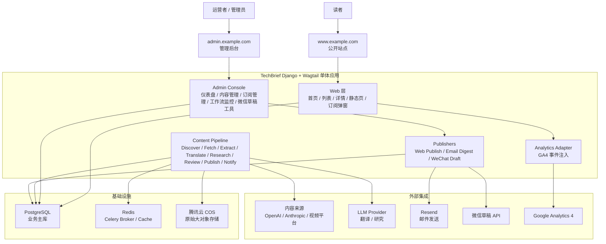
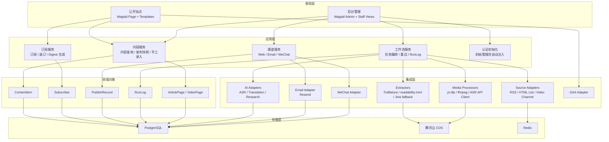
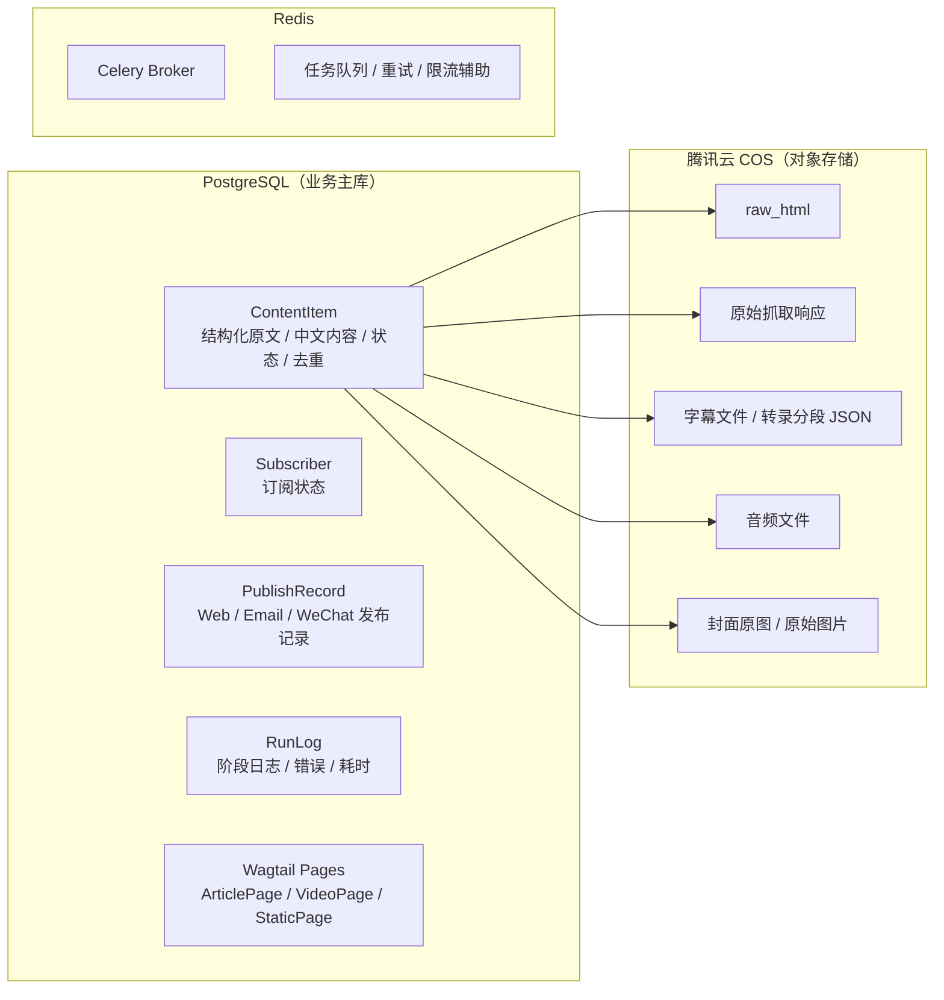
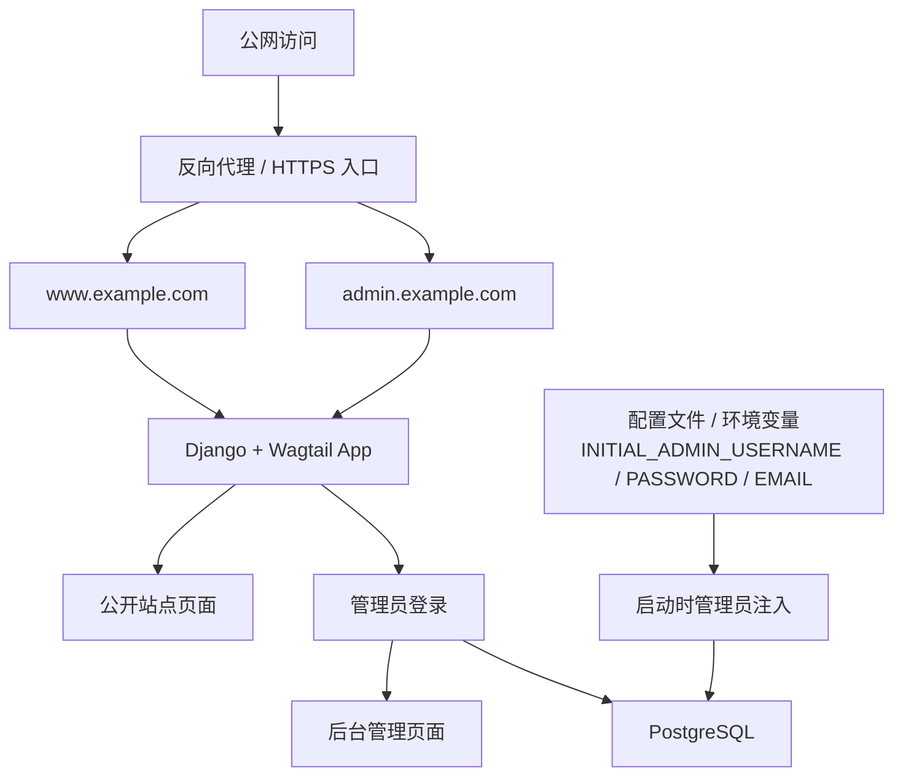
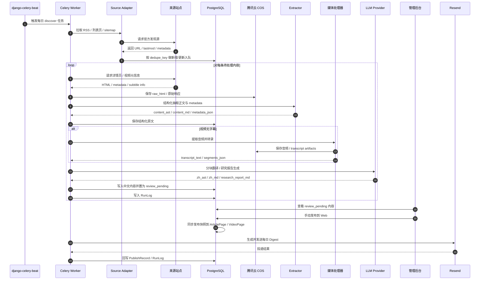
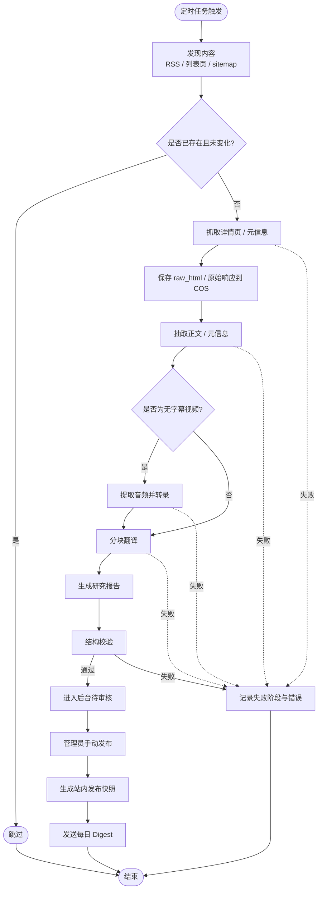
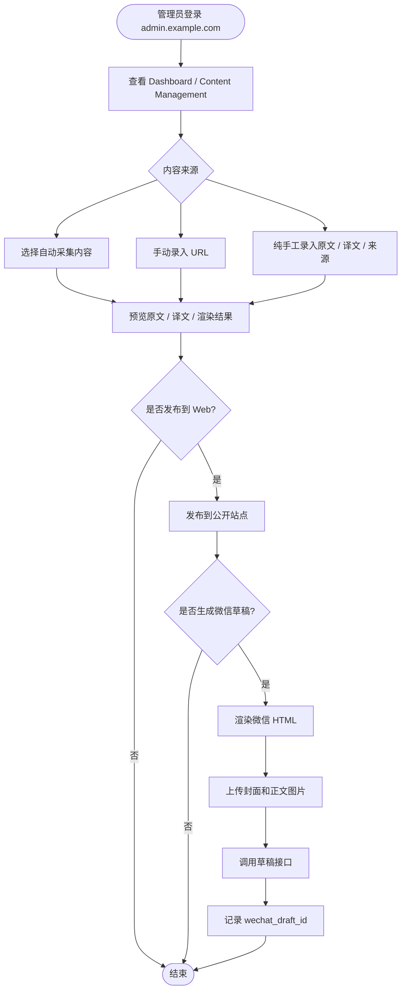

# TechBrief 系统架构图

更新时间：2026-06-03

## 1. 文档目标

本文基于当前已确认的 PRD 与技术方案，输出一份可执行的系统架构图文档。文档采用自顶向下的方式描述：

- 产品边界与访问入口；
- 系统内部功能模块划分；
- 核心数据与基础设施依赖；
- 自动内容处理主链路时序；
- 核心业务流程图。

当前架构以单人维护、MVP 快速落地为前提，遵循“简单、可运行、可追溯、可扩展”的原则，不引入复杂权限系统和过度拆分的微服务架构。

## 2. 顶层架构

## 3. 模块分层

## 4. 存储架构

## 5. 域名与访问控制

## 6. 自动内容处理主链路时序图

## 7. 自动内容处理流程图

## 8. 后台审核与手动发布流程图

## 9. 关键架构决策

- **单体优先**：采用 Django + Wagtail 单体架构，减少单人项目的部署与维护成本。
- **模块内聚**：公开站点、后台管理、内容流水线、渠道发布在同一应用内分模块组织，而不是拆成多个服务。
- **数据库与对象存储分层**：结构化业务数据进入 PostgreSQL，raw HTML、字幕、音频、图片进入腾讯云 COS。
- **异步任务统一编排**：内容发现、抓取、翻译、转录、邮件发送统一交给 Celery + `django-celery-beat`。
- **人工发布把关**：自动处理只负责生成待审核内容，最终 Web 发布与微信草稿生成都需要管理员确认。
- **权限保持简单**：后台只采用管理员登录，不设计复杂角色系统。

## 10. 建议的后续落地图谱

- 先落库核心模型：`ContentItem`、`Subscriber`、`PublishRecord`、`RunLog`
- 再实现基础页面：首页、列表页、详情页、后台登录
- 然后接通自动采集主链路：discover -> fetch -> extract -> translate -> review
- 最后补齐运营能力：digest 邮件、微信草稿工具、GA4 埋点、后台工作流监控
